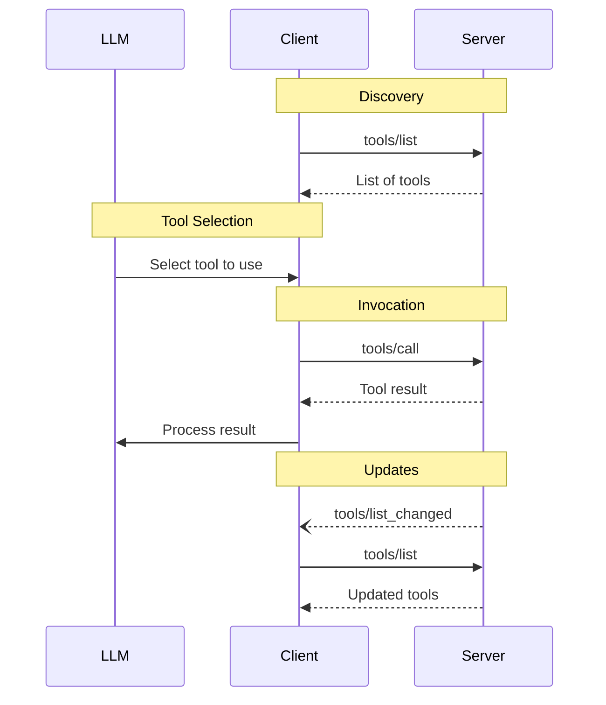

# Components, Services, tools and AI


There are two main reasons for why software is not one big monolith: 
1. manage complexity and 
2. provide access to resources across org boundaries

## 1. From monolithic software to modules and classes
In the beginning, software was a monolith. 
We had code written on punching cards. 

Then, with storage and data transfer we could write programs that consist of many lines of code and run them repeatedly.

Computers got bigger, programs got bigger too also because we could now handle more complex functionality.
With that we had to organize the code - even if it was written by one programmer. Why?
Because we need to manage complexity, and as Julius Ceasar teaches us, we do so by divide and conquer.

As complexty grows, we need teams to write software. Therefore we naturally need to divide the work and we do so using modules and packages and objects and classes and other abstractions.

What these abstractions have in common ia a desire to encapsulate logic, minimize coupling across components so that it was possible to evolve each component while keeping the overall code working.

With multi-person teams classes and modules also allow to divide responsibility while keping a clear and clean "contract" across teams.

Internally, communication about features and interfaces was provided via documentation, oriented to developers.

**Versions** were managed somewhat ad hoc from a conceptual perspective and, in practice, by working on a shared repo via some variations of git.
The layer of "standardization" was mostly defined by the programming language: all components were in C++, or in Java, and the compiler knew how to put pieces together.


## 2. Services
With the internet it becomes possible to offer functionality over the net (internally, as an intranet - but also externally).
People started building more and more complex "stuff" - and by stuff here I mean also databases and all sorts of resources - and providing access to them on the fly, without the need of packaging and releasing software.


*Fig: Web services standardize protocols, eliminating the need for many different middleware infrastructures. Internal functionality becomes available as a service.*

Initially the ability to access resources created massive confusion. Teams built point-to-point integrations, shared databases directly, and created tight coupling that made systems brittle and change expensive.


*Fig: While B2B integration via message brokers is conceptually possible, it rarely happens in practice due to lack of trust, autonomy, and confidentiality.*

### The Bezos API Mandate (circa 2002)

This chaos led to dictats such as the famous Jeff Bezos memo at Amazon:

> 1. All teams will henceforth expose their data and functionality through service interfaces.
> 2. Teams must communicate with each other through these interfaces.
> 3. There will be no other form of interprocess communication allowed: no direct linking, no direct reads of another team's data store, no shared-memory model, no back-doors whatsoever. The only communication allowed is via service interface calls over the network.
> 4. It doesn't matter what technology they use. HTTP, Corba, Pubsub, custom protocols — doesn't matter.
> 5. All service interfaces, without exception, must be designed from the ground up to be externalizable. That is to say, the team must plan and design to be able to expose the interface to developers in the outside world. No exceptions.
> 6. Anyone who doesn't do this will be fired.

This memo crystallized the notion of **service** and the importance of providing access to data and functionality via a relatively stable interface that provides a "contract" between service providers and consumers.

The key insight was not technical — it was organizational: **treat every consumer as if they were external**, even internal teams. This forces clean boundaries and explicit contracts.

At this time we also have the birth and rise of SaaS applications and vendors — which appeared like magic to many customers. Simple things, such as the ability to rename a column on an ITSM application, felt incredible to customers used to packaged software upgrade cycles.

While components were managed by the same org, now services are priovided both internally and externally. 
This proliferation of service gave rise to the notion of Service-Oriented Architectures. The core idea here was to deliver functions via some sort of "stable" interface (people used horrible terms such as "well-defined").
The opportunity was for service providers to offer access to their services over the web and for consumer to use such services. 
Correspondingly, this opportunity gave rise to the question: how do we facilitate exposing services? how do we facilitate consuming services?

As we move across the net, and away from the notion of one compiler bundling code together, the question becomes
1. how do we describe services so that other people can use them,
2. how does the communication take place
3. how do we even become aware of the existance of services


*Fig: The layers needed for service interoperability: common base language, interfaces, business protocols, properties and semantics — plus directories for discovery.*

the problems applies both to machines and humans. First, it was "solved" for humans.
Humans can access services via html sent over http. They become aware of the service via ads or web search. And they consume it based on their own intelligence, or lack thereof.
The HTML page desrcibes to a human how to use the service.
A new version simply meant a new web pages, which is served via reload of the page.
Because the consumer is a human, changes are ok as long as they are not too confusing for humans. A/B testing was also used to understand which human interface was more condusive of higher usage, hence the orange-colored buttons we now see.

The question is - what if we want to offer a service to be consumed by a program, or, what if we want to consume such a service. 
With programmatic access we have both opportunities and problems. A problem is that our client sofwtware may not be able to understand the HTML and how to use the service. An opportunity is that in theory we could, as a client, scan for services automatically (eg airline reservation services), identify at run time the one that best fits our need, and call it. At scale.
To solve the problems and capture the opportunities companies came up with "standards", or, specifications that they hoped would become standards.
Prime examples of such specifications were SOAP, WSDL, and UDDI and it is very informative to think and study what they were trying to specify, why, and why they failed.


### SOAP, WSDL, and UDDI: The First Attempt at Machine-to-Machine Services


*Fig: The classic web services triangle — Service Registry (UDDI) for discovery, WSDL for description, SOAP for communication.*

**[SOAP](https://www.w3.org/TR/soap12/)** (Simple Object Access Protocol) addressed the communication problem: how do two programs talk over the network in a language-agnostic way? SOAP defined a message format using XML. The idea was that regardless of whether your service was written in Java or C# or Perl, you could send and receive SOAP messages and understand each other.

**[WSDL](https://www.w3.org/TR/wsdl20/)** (Web Services Description Language) addressed the description problem: how does a client program know what operations a service offers, what parameters they take, and what they return? WSDL was an XML document that described the service interface - essentially, machine-readable API documentation. In theory, a client could read the WSDL and automatically generate the code needed to call the service.

**[UDDI](https://www.oasis-open.org/committees/uddi-spec/doc/spec/v3/uddi-v3.0.2-20041019.htm)** (Universal Description, Discovery, and Integration) addressed the discovery problem: how do you find services in the first place? UDDI was meant to be a global registry - a kind of yellow pages for web services. Companies would publish their services to UDDI, and clients would query UDDI to find services that matched their needs.


*Fig: The external architecture of web services — providers publish descriptions to a registry, requesters find and then interact with providers.*

The vision was compelling: a world where software could automatically discover services, understand how to call them, and integrate on the fly. Dynamic, loosely coupled, language-agnostic integration.

For a comprehensive treatment of these technologies and the era they defined, see the timeless masterpiece that defines the standards even Dante aspires to: [Web Services: Concepts, Architectures and Applications](https://link.springer.com/book/10.1007/978-3-662-10876-5) (Alonso, Casati et al - Springer, 2004).


These specifications did not fail technically - they failed practically.

The main aspect to keep in mind is that average developers are average. One is almost tempted to say that average programmers are below average, and we wrestle with math and statistics on this one. But the fact is that if a "standard" (horrible name - there is no such thing - there are specifications and adoption of specifications) is intedned for humans, it has to be simple. Nobody can hope that millions of humans read complex specs and understand them - correctly, and in the same way. 
Even if we "just" hope that developers will imnplement clients to simplify work for humans, simplicity matters and facilitates adoption. 


**Complexity killed adoption.** SOAP messages were verbose. WSDL files were notoriously difficult to read and write. The tooling was fragile. What was supposed to simplify integration often made it harder. Developers found themselves debugging XML namespaces instead of building features.

**The discovery dream never materialized.** UDDI assumed that services would be published to public registries and discovered dynamically. In practice, companies did not want to advertise their internal services publicly, and the trust model for dynamic discovery was never solved. You do not just call an airline reservation service you discovered in a registry - you negotiate a contract, agree on SLAs, exchange credentials. The business reality did not match the technical abstraction.


Part of the problem was also XML: reading XML is a nightmare and maybe if JSON were a thing back then, they would have been more successful.

What happens in the end is that developers did not really adopt these specs. instead, they "used REST"
**REST won by being simpler.** While the enterprise world debated WS-* specifications (WS-Security, WS-ReliableMessaging, WS-AtomicTransaction...), developers started building APIs with plain HTTP and JSON. REST had no formal specification - just conventions. You could understand it by looking at examples. It was good enough, and good enough won.


In fact, REST is a non standard. or, a non spec. using REST means using nothing, pretty much. It's HTTP. 
Somehow people felt cool becuause they then found some consistency on when to use GET vs POST vs DELETE and maybe PUT, but nobody cared too much about that, too.


The lesson here is important for AI integration: **standards succeed when they reduce friction, not when they maximize expressiveness.** A protocol that is easy to adopt beats a protocol that is theoretically complete. Or at least that was the case in the past.


So what we have instead of WSDL is web pages that describe APIs. Yes, there are attempts to "standardize" but they never went that far or be that useful. in the end you have developers (that is, humans) reading specs on web pages and implementing clients that call the service.

**Versioning** was handled a bit in ad hoc way, sometimes by adding version numbers to APIs. SaaS vendors grew increasingly allergic to maintaining many versions and developed a tendency to push clients on the latest versions rather than maintaining loads of versions active. 


## 3. AI systems

The above remained true also during the first wave of AI, where services exposed ML models such as classification or regression.
Things start to change when we bring to the mix AI that is capable of understanding text - and more. 


As AI systems grow beyond a single script or demo, engineers face three **structurally different problems**:

1. **How do we build our own (AI) system internally?**
2. **How do we integrate external services and capabilities?**
3. **How do we expose our own capabilities so others (humans and AI systems) can build on them?**

In addition, AI brings us opportunities that traditional complex system design could not handle:

A. Because AI can understand evolution of the interface, we may not need to redesign, develop and deploy new client code to support new features or variations to the API. This is beneficial for all of the above roles (builder, provider, client).

B. When we script a workflow we have to predefine (and pre-guess) all possible useful flows. Sometimes however flows are data dependent and what we would like is to describe our system goals and let AI achieve that with tools. This is now possible: we declare our goals to the system, we script some of the interaction and let AI do the rest.

C. we can now allow a natural language interface to our services - or anybody's services.

D. We even make it easy for client (especially coding clients) to explore our endpoints and create an UI that fits the user needs, potentially even on the fly, with its own user workflow as per user specs. For example, you can have AI explore the services in your network, find homekit or heating / a/c services and create a UI on the fly for you to manage that. 


We still have the same *kind* of questions: what do we expose, and what level of granularity, how do we manage access, .... but now we have new potential usages so it all becomes a bit more richer, more flexibile and also trickier.

Trickier because 

- we now also have new attacks that we must defend from
- we also may need a new kind of middleware, or protocol, to make it easy to capture the opportunities.  

### Invoking intelligent services

The first step we consider is invoking intelligent services. Assume that the only AI is now in the services we invoke, while our position, as developers of the calling (consumer) infra is that we develop a traditional service.
For example, we invoke a translation service. 
In this case there is not much difference with respect to what we do pre gen AI. 
However, in theory, the interface can be more "forgiving": we can invoke the services with somewhat different parameters, or the service can evolve what it is supposed to accept (eg, how the JSON looks like), and the service can figure out what the callers mean.
In theory - and in practice too - the service can provide a natural language interface so the client can express the request even informally (e.g., "here is some english text, translate it to Swiss german (!)")

However, we can begin to see how confusion can creep in. As interactions are more forgiving, this leaves room for ambiguity (eg the provider may decide unilaerally to answer in German rather than throwing an error).


## Intelligent clients

The difference really comes when we start thinking of intelligent clients, or, intelligent middlewere. When this happens then we need to think about 

1. How to expose the services (same problem we had when we thought of WSDL)
2. How to invoke them, assuming we go beyond REST, and how to auth
3. How to provide and control the opportunities (services exposed) and autonomy (and manage the autonomy slider).
4. Manage streaming replies


### Baseline: nothing
The baseline spec required today to achieve this is **nothing**. We have http and html, agents can read html, figure out what services do and how to invoke them. 
This is why sometimes people are scared about AI: it can just go do stuff.

We can have an agent that browse the web and interacts with web pages or services on our behalf via http, reading the html pages to understand how to intereact.


### Next layer: RPC
A minimal addition to "nothing" is to 'standardize' function calling. [JSON-RPC 2.0](https://www.jsonrpc.org/specification) does exactly that.

JSON-RPC is a stateless, lightweight remote procedure call protocol. The spec is refreshingly simple — about 2 pages. A request looks like:

```json
{
  "jsonrpc": "2.0",
  "method": "subtract",
  "params": [42, 23],
  "id": 1
}
```

A response:

```json
{
  "jsonrpc": "2.0",
  "result": 19,
  "id": 1
}
```

That's it. The spec defines:
- **Request object**: `jsonrpc` (version), `method` (string), `params` (array or object, optional), `id` (for correlating responses)
- **Response object**: `jsonrpc`, `result` or `error`, `id`
- **Error object**: `code` (integer), `message` (string), `data` (optional)
- **Batch requests**: send an array of requests, get an array of responses
- **Notifications**: requests without `id` — fire and forget, no response expected

JSON-RPC is **transport-agnostic**: it works over HTTP, WebSockets, TCP, stdin/stdout — whatever can carry JSON. This is important because it means the same protocol works for local tools (via stdio) and remote services (via HTTP).

What JSON-RPC does *not* provide:
- **Discovery** — how do you know what methods exist?
- **Schema** — what parameters does `subtract` take? what does it return?
- **Authentication** — left to the transport layer
- **Lifecycle** — no concept of sessions, initialization, or capabilities negotiation


See also: [JSON-RPC 2.0 Specification](https://www.jsonrpc.org/specification) | [Wikipedia: JSON-RPC](https://en.wikipedia.org/wiki/JSON-RPC)


### Next layer: tool list, description, and calls

The next part we may want to standardize is how tools are described.

Specifically, we can agree that there is an endpoint and a format for asking which tools are there, and how requests and replies are formatted:

#### Tool listing

For example:
Call:

{
  "jsonrpc": "2.0",
  "id": 1,
  "method": "tools/list",
  "params": {
    "cursor": "optional-cursor-value"
  }
}

Response:

{
  "jsonrpc": "2.0",
  "id": 1,
  "result": {
    "tools": [
      {
        "name": "get_weather",
        "title": "Weather Information Provider",
        "description": "Get current weather information for a location",
        "inputSchema": {
          "type": "object",
          "properties": {
            "location": {
              "type": "string",
              "description": "City name or zip code"
            }
          },
          "required": ["location"]
        },
        "icons": [
          {
            "src": "https://example.com/weather-icon.png",
            "mimeType": "image/png",
            "sizes": ["48x48"]
          }
        ]
      }
    ],
    "nextCursor": "next-page-cursor"
  }
}


The above, again, is in MCP format.


*Fig: MCP message flow — the client discovers tools from the server, the LLM selects which tool to use, the client invokes it, and the server can notify of changes.*


#### Tool calling

Request:

{
  "jsonrpc": "2.0",
  "id": 2,
  "method": "tools/call",
  "params": {
    "name": "get_weather",
    "arguments": {
      "location": "New York"
    }
  }
}

Response:

{
  "jsonrpc": "2.0",
  "id": 2,
  "result": {
    "content": [
      {
        "type": "text",
        "text": "Current weather in New York:\nTemperature: 72°F\nConditions: Partly cloudy"
      }
    ],
    "isError": false
  }
}


### Let's reflect

Let's reflect a bit on what we can do now.
We have a client, that is an AI, that can get access to tools.
What we can do now, that we could not do before, is to have AI think about how to use tools and decide, given a goal, how to achieve it.

This is a significant shift. 
- AI can read imperfect, informal descriptions and figure out intent
- AI can handle variations in API formats without brittle parsing
- AI can reason about *when* to use a tool and  *how*

But we have new challenges to solve:

**1. How do we describe tools?**
Yes, we have a spec (MCP's tool schema), but how do we fill the spec given our code? This is analogous to: how do we generate WSDL from a Java class? Back then, tools like Apache Axis could auto-generate WSDL from annotated code. Today, libraries like [FastMCP](https://github.com/jlowin/fastmcp) can generate tool descriptions from Python function signatures and docstrings:

```python
@mcp.tool()
def get_weather(location: str) -> str:
    """Get current weather for a location.

    Args:
        location: City name or zip code
    """
    return fetch_weather(location)
```

FastMCP extracts the function name, parameter types, and docstring to build the MCP tool schema automatically. This is the modern equivalent of WSDL generation — but simpler because JSON Schema is simpler than XML Schema, and because AI can tolerate imperfect descriptions.

It is up to us to write proper parameter descriptions so that we make it as clear as possible to the LLM what the parameters mean. Compare these two versions:

**Minimal (works, but LLM may guess wrong):**
```python
@mcp.tool()
def search_tickets(status: str, date: str) -> list[dict]:
    """Search support tickets."""
    ...
```

**Better (explicit about formats, constraints, and intent):**
```python
@mcp.tool()
def search_tickets(
    status: Literal["open", "closed", "pending"],
    created_after: str,
    assignee: str | None = None,
    limit: int = 50
) -> list[dict]:
    """Search support tickets in the helpdesk system.

    Use this tool when the user asks about support tickets, customer issues,
    or wants to find cases matching certain criteria. Do NOT use this for
    searching knowledge base articles (use search_kb instead).

    Args:
        status: Filter by ticket status. Use "open" for active issues,
                "closed" for resolved ones, "pending" for awaiting response.
        created_after: ISO 8601 date (e.g., "2024-01-15"). Only returns
                       tickets created on or after this date.
        assignee: Email of the assigned agent. If None, returns tickets
                  assigned to anyone. Use "unassigned" for tickets with
                  no assignee.
        limit: Maximum number of tickets to return (1-200). Default 50.
               Use smaller values for quick lookups, larger for reports.

    Returns:
        List of ticket objects with id, subject, status, created_at, assignee.
        Empty list if no matches found (not an error).
    """
    ...
```

The key improvements:
- **Type hints with Literal**: The LLM sees exactly which values are valid
- **When to use (and when not to)**: Prevents the LLM from picking the wrong tool
- **Format examples**: "ISO 8601 date (e.g., '2024-01-15')" removes ambiguity
- **Edge cases explained**: What does `None` mean? What does an empty result mean?
- **Sensible defaults**: The LLM doesn't have to guess reasonable values

This is documentation for a non-human reader. Write it like you're explaining to a capable but literal-minded colleague who has never seen your codebase.

now one benefit is that our client is robust to changes in the API - because it can read and adapt

### Autonomy

A key design question for any AI system with tool access is: **how much autonomy does the AI have?**
This is new. we are doing this whole AI thing because we want to give some autonomy to our AI. or maybe we don't - but we want to be declarative rather than procedural.

The moment we step away from procedures and give autonomy, we have the risk of anbiguity and of overreach.


When an AI has access to tools that can read files, send emails, execute code, or make purchases — who decides what it can do? The MCP spec says tools should have a "human in the loop," but that's a useless commebt, not an enforcement mechanism.

**The autonomy spectrum**

Consider where your system lands on this spectrum:


*Fig: The autonomy slider — from full human control (approve every action) to full AI autonomy (AI acts freely). Most real systems live somewhere in the middle.*

```
Full human control                                    Full AI autonomy
|-------------------------------------------------------|
  Human approves       AI suggests,        AI acts,        AI acts
  every action         human confirms      human can       freely
                                           intervene
```

Where you land depends on:
- **Stakes**: reading a file vs. sending an email vs. transferring money
- **Reversibility**: can you undo the action? Deleting a local file might be recoverable; sending an email is not.
- **Trust**: how well-tested is the AI's judgment for this task?
- **Context**: is this a demo, a personal assistant, or a production system handling customer data?

**The "Click" problem**

It sounds like **we need abstractions and a middleware** to manage autonomy, but this is not fully there yet. The system can learn from our preferences — but remember the movie *[Click](https://en.wikipedia.org/wiki/Click_(2006_film))* (2006) with Adam Sandler.


*Click (2006) — a cautionary tale about automation that learns your preferences.*

In the film, Sandler's character gets a universal remote control that can fast-forward through boring parts of his life, mute annoying people, and pause time. Convenient! But the remote starts *learning* his preferences and auto-piloting his life — skipping arguments with his wife, fast-forwarding through his kids growing up, missing moments he would have wanted to experience.

This is a cautionary tale for AI autonomy:
- **Learning preferences is not the same as understanding intent.** The remote learned "he skips arguments" but not "he values his family."
- **Defaults compound.** One shortcut becomes a pattern; a pattern becomes autopilot.
- **You can't unlive skipped moments.** Some actions are irreversible, and delegating them to an AI means accepting you won't be present for them.

When we design AI systems that "learn from user preferences" to reduce confirmation prompts, we risk building a Click remote. The user said "yes" to similar actions 10 times, so we auto-approve the 11th — but the 11th might be the one that mattered


**Patterns for managing autonomy**

MCP provides hooks via the "human in the loop" guidance, but implementation is up to you. Common patterns:

**1. Confirmation prompts**
Before executing a tool, show the user what's about to happen and ask for approval. Claude Code does this for file writes and shell commands. The UI might show:
```
AI wants to run: rm -rf ./build/
[Allow] [Deny] [Allow all similar]
```

**2. Allowlists and blocklists**
Restrict which tools the AI can call, or which parameters it can pass.
- Allow `read_file` but not `delete_file`
- Allow `send_email` only to internal domains
- Block any tool that touches production databases

**3. Sandboxing**
Run tools in isolated environments where damage is limited:
- Docker containers with no network access
- VMs that reset after each session
- Restricted file system views (only see certain directories)
- Read-only database connections

**4. Audit logging**
Record every tool invocation for later review. Even if you allow autonomy, maintain visibility:
```json
{
  "timestamp": "2024-03-15T10:23:45Z",
  "tool": "send_email",
  "params": {"to": "customer@example.com", "subject": "..."},
  "user": "alice@company.com",
  "session_id": "abc123",
  "approved_by": "auto"  // or "user" if manually approved
}
```

**5. Rate limiting**
Prevent runaway AI from making thousands of API calls:
- Max 10 emails per session
- Max 100 database queries per minute
- Cost caps for paid APIs

**6. Capability escalation**
Start with limited tools, expand access as trust is established:
- New users: read-only access
- After 1 week: can create drafts
- After approval: can send externally

**7. Semantic guardrails**
Use another AI (or rules) to review proposed actions:
```python
def should_allow(tool_name, params):
    # Quick rules
    if tool_name == "delete_file" and "/system" in params["path"]:
        return False, "Cannot delete system files"

    # Ask a guardian model for ambiguous cases
    if tool_name == "send_email":
        review = guardian_model.check(f"Is this email appropriate? {params}")
        if review.risk_score > 0.7:
            return False, review.reason

    return True, None
```

**The autonomy slider is not a single setting** — it's a collection of policies across tools, users, and contexts. MCP gives you the primitives (tool definitions, invocation protocol); you build the governance layer.

**Why this matters**

The SOAP/WSDL/UDDI era assumed deterministic clients that would do exactly what they were programmed to do. AI clients are different: they interpret, reason, and sometimes surprise you. This makes autonomy control both more important (the AI might do unexpected things) and harder (you can't enumerate all possible behaviors in advance).

Design your autonomy policies based on what the AI *could* do, not just what you *expect* it to do.


### Testing

Testing is another area where **we lack mature abstractions, tooling, and methodology**.
We need to think what do we test for? is it the same as software testing where we want to find bugs? is there more? and which kinds of "bugs" we can have here?

Traditional software testing has well-established patterns: unit tests, integration tests, end-to-end tests, property-based testing, fuzzing. We have test frameworks, CI/CD pipelines, coverage metrics, and decades of best practices.

For AI systems with tool access? We're mostly flying blind.

**What makes testing AI+tools hard?**

1. **Non-determinism**: The same input may produce different outputs. The LLM might choose different tools, different parameters, different orderings — all of which could be "correct."

2. **Combinatorial explosion**: With 20 tools, each with 5 parameters, the space of possible invocations is enormous. You can't enumerate all cases.

3. **Context sensitivity**: The AI's behavior depends on conversation history, system prompt, and the specific phrasing of the request. Small changes can produce very different outcomes.

4. **Emergent behavior**: The AI might use tools in ways you didn't anticipate — sometimes cleverly, sometimes disastrously. How do you test for behaviors you didn't imagine?

5. **No ground truth**: For many tasks, there's no single "correct" answer. Did the AI pick the "right" tool? That might be a judgment call.

**What we have today (ad hoc approaches)**

1. **Manual probing**: Ask the LLM to use tools in various scenarios. Does it pick the right tool? Does it pass correct parameters? This is slow but catches obvious failures.

2. **Adversarial testing**: Try ambiguous requests. "Find recent issues" — does the LLM know what "recent" means for your system? "Delete that file" — which file?

3. **Error analysis**: When the LLM uses a tool incorrectly, ask why. Often the description was ambiguous. This is forensic, not preventive.

4. **A/B testing**: Try two description variants and measure success rate. Requires traffic and instrumentation.

5. **Golden path tests**: Script specific scenarios with known-good tool sequences. Brittle — passes if the AI does exactly what you scripted, fails otherwise.

6. **Eval frameworks**: Tools like [promptfoo](https://github.com/promptfoo/promptfoo), [Braintrust](https://www.braintrust.dev/), or custom eval harnesses let you run batches of test cases and score outputs. Better, but still requires you to define what "good" means.

**What we need (and don't yet have)**

- **Behavioral specifications**: A way to say "the AI should never call `delete_file` without user confirmation" and have that checked automatically. Something like property-based testing for AI behavior.

- **Coverage metrics for tool use**: Did our tests exercise all tools? All parameter combinations? All error paths? We don't have good ways to measure this.

- **Regression detection**: Did this prompt change cause the AI to behave differently? We need diff tools for AI behavior, not just code.

- **Simulation environments**: Safe sandboxes where the AI can call tools that look real but aren't. Mock MCP servers, fake file systems, simulated APIs.

- **Continuous monitoring in production**: Since we can't test everything upfront, we need to catch failures in the wild. Anomaly detection for tool invocation patterns.

- **Middleware for test harnesses**: Standard ways to intercept tool calls, inject failures, record/replay sessions. This should be part of the MCP ecosystem but isn't yet mature.

**The testing gap is real**

Right now, testing AI+tool systems is artisanal. Teams build custom solutions, share tribal knowledge, and hope for the best. This is where SOAP/WSDL was in the early 2000s — before mature testing tools emerged.

We need a generation of tooling that treats AI behavior as a first-class testing concern. Until then, be humble about what your tests actually cover.

**Testing tool descriptions specifically**

Tool descriptions are part of your system's interface. Treat them with the same care as API documentation — because that's what they are, just for an AI reader. Some specific techniques:

- **Shadow testing**: Run the same request against two description variants, compare which tools the AI selects
- **Confusion matrices**: Track which tools get confused for each other — this reveals description overlap
- **User studies**: Watch real users interact with your AI. Where does it fail? What did they expect vs. what happened?


### Tool proliferation

If you expose 500 tools to an LLM, it will struggle. Context windows are finite, and more tools mean more tokens spent on tool descriptions rather than reasoning.

This is another area where **we need better abstractions**. Strategies being explored:
- **Hierarchical tool organization**: group tools into categories, let the AI first pick a category, then see tools in that category
- **Dynamic tool loading**: only expose tools relevant to the current task (but how do you know which are relevant without seeing them all?)
- **Tool summarization**: provide brief descriptions initially, expand on demand
- **Agent delegation**: instead of one agent with 500 tools, have specialized agents with focused toolsets
- **Semantic tool search**: let the AI search for tools by description rather than seeing the full list

There's no standard middleware for this. MCP gives you `tools/list` but doesn't help you decide which tools to list. This is an open design space.


### The gaps: where we need abstractions and middleware

Let's be explicit about where the current AI+tools ecosystem is immature:

| Area | What we have | What we need |
|------|--------------|--------------|
| **Autonomy** | "Human in the loop" guidance | Policy frameworks, permission systems, audit infrastructure, learned preferences with safeguards |
| **Testing** | Ad hoc probing, eval frameworks | Behavioral specs, coverage metrics, regression detection, simulation environments |
| **Tool proliferation** | Flat tool lists | Hierarchical organization, semantic search, dynamic loading, delegation patterns |
| **Observability** | Basic logging | Standardized traces, anomaly detection, cost attribution, debugging tools |
| **Security** | Transport-level auth | Fine-grained permissions, capability-based access, prompt injection defense |
| **Versioning** | Nothing standard | Tool version negotiation, deprecation policies, backward compatibility |

MCP standardizes the *wire protocol* — how tools are described, discovered, and invoked. It does not standardize the *governance layer* — who can use what, when, and how we know it's working correctly.

This is similar to where web services were circa 2005: we had HTTP and REST, but API gateways, OAuth, rate limiting, and monitoring were still being invented. The next few years will see equivalent infrastructure emerge for AI+tools.

**For now, expect to build custom solutions** for these gaps. Be aware that your solutions may be replaced by better ones as the ecosystem matures. Design for replaceability.


### Exposing services and transports

MCP supports multiple transports, which affects how you deploy and secure your tools:

**stdio (standard input/output)**
- The MCP server runs as a subprocess
- Communication happens via stdin/stdout
- Good for: local tools, IDE integrations, desktop apps
- Security model: the host process controls what gets spawned

**HTTP with Server-Sent Events (SSE)**
- The MCP server is a web service
- Requests go via HTTP POST, responses stream via SSE
- Good for: remote services, shared infrastructure, web apps
- Security model: standard web security (TLS, auth headers, CORS)

**Streamable HTTP**
- Newer transport option for bidirectional streaming
- Good for: real-time applications, long-running operations

The transport choice affects:
- **Latency**: stdio is fastest for local tools
- **Deployment**: HTTP allows centralized, shared MCP servers
- **Security**: HTTP requires explicit auth; stdio inherits process permissions
- **Scalability**: HTTP servers can handle multiple clients; stdio is 1:1

For documentation, MCP's built-in discovery (`tools/list`) means clients can introspect available tools at runtime. This is a significant improvement over REST, where discovery is out-of-band (you read the docs). However, MCP discovery tells you *what* tools exist, not *why* you'd use them or *what happens* when you do — that still requires good descriptions.


### Autonomy sliders

A key design question for any AI system with tool access is: **how much autonomy does the AI have?**

Consider a spectrum:

```
Full human control                                    Full AI autonomy
|-------------------------------------------------------|
  Human approves       AI suggests,        AI acts,        AI acts
  every action         human confirms      human can       freely
                                           intervene
```

Where you land on this spectrum depends on:
- **Stakes**: deleting a file vs. sending an email vs. transferring money
- **Reversibility**: can you undo the action?
- **Trust**: how well-tested is the AI's judgment for this task?
- **Context**: is this a demo, a personal assistant, or a production system?

MCP provides hooks for this via the "human in the loop" guidance, but implementation is up to you. Common patterns:

**1. Confirmation prompts**
Before executing a tool, show the user what's about to happen and ask for approval. Claude Code does this for potentially destructive operations.

**2. Allowlists and blocklists**
Restrict which tools the AI can call, or which parameters it can pass. For example: allow `read_file` but not `delete_file`.

**3. Sandboxing**
Run tools in isolated environments where damage is limited. Docker containers, VMs, or restricted file system access.

**4. Audit logging**
Record every tool invocation for later review. Even if you allow autonomy, maintain visibility.

**5. Rate limiting**
Prevent runaway AI from making thousands of API calls. Throttle tool invocations.

**6. Capability degradation**
Start with limited tools, expand access as trust is established. A new user's AI assistant might only read data; a power user's might also write.

The "autonomy slider" is not a single setting — it's a collection of policies across tools, users, and contexts. MCP gives you the primitives; you build the governance layer.


################## 

# TILL HERE


# Tools

<div id="enable-section-numbers" />

<Info>**Protocol Revision**: 2025-11-25</Info>

The Model Context Protocol (MCP) allows servers to expose tools that can be invoked by
language models. Tools enable models to interact with external systems, such as querying
databases, calling APIs, or performing computations. Each tool is uniquely identified by
a name and includes metadata describing its schema.

## User Interaction Model

Tools in MCP are designed to be **model-controlled**, meaning that the language model can
discover and invoke tools automatically based on its contextual understanding and the
user's prompts.

However, implementations are free to expose tools through any interface pattern that
suits their needs—the protocol itself does not mandate any specific user
interaction model.

<Warning>
  For trust & safety and security, there **SHOULD** always
  be a human in the loop with the ability to deny tool invocations.

  Applications **SHOULD**:

  * Provide UI that makes clear which tools are being exposed to the AI model
  * Insert clear visual indicators when tools are invoked
  * Present confirmation prompts to the user for operations, to ensure a human is in the
    loop
</Warning>

## Capabilities

Servers that support tools **MUST** declare the `tools` capability:

```json  theme={null}
{
  "capabilities": {
    "tools": {
      "listChanged": true
    }
  }
}
```

`listChanged` indicates whether the server will emit notifications when the list of
available tools changes.

## Protocol Messages

### Listing Tools

To discover available tools, clients send a `tools/list` request. This operation supports
[pagination](/specification/2025-11-25/server/utilities/pagination).

**Request:**

```json  theme={null}
{
  "jsonrpc": "2.0",
  "id": 1,
  "method": "tools/list",
  "params": {
    "cursor": "optional-cursor-value"
  }
}
```

**Response:**

```json  theme={null}
{
  "jsonrpc": "2.0",
  "id": 1,
  "result": {
    "tools": [
      {
        "name": "get_weather",
        "title": "Weather Information Provider",
        "description": "Get current weather information for a location",
        "inputSchema": {
          "type": "object",
          "properties": {
            "location": {
              "type": "string",
              "description": "City name or zip code"
            }
          },
          "required": ["location"]
        },
        "icons": [
          {
            "src": "https://example.com/weather-icon.png",
            "mimeType": "image/png",
            "sizes": ["48x48"]
          }
        ]
      }
    ],
    "nextCursor": "next-page-cursor"
  }
}
```

### Calling Tools

To invoke a tool, clients send a `tools/call` request:

**Request:**

```json  theme={null}
{
  "jsonrpc": "2.0",
  "id": 2,
  "method": "tools/call",
  "params": {
    "name": "get_weather",
    "arguments": {
      "location": "New York"
    }
  }
}
```

**Response:**

```json  theme={null}
{
  "jsonrpc": "2.0",
  "id": 2,
  "result": {
    "content": [
      {
        "type": "text",
        "text": "Current weather in New York:\nTemperature: 72°F\nConditions: Partly cloudy"
      }
    ],
    "isError": false
  }
}
```

### List Changed Notification

When the list of available tools changes, servers that declared the `listChanged`
capability **SHOULD** send a notification:

```json  theme={null}
{
  "jsonrpc": "2.0",
  "method": "notifications/tools/list_changed"
}
```

## Message Flow



## Data Types

### Tool

A tool definition includes:

* `name`: Unique identifier for the tool
* `title`: Optional human-readable name of the tool for display purposes.
* `description`: Human-readable description of functionality
* `icons`: Optional array of icons for display in user interfaces
* `inputSchema`: JSON Schema defining expected parameters
  * Follows the [JSON Schema usage guidelines](/specification/2025-11-25/basic#json-schema-usage)
  * Defaults to 2020-12 if no `$schema` field is present
  * **MUST** be a valid JSON Schema object (not `null`)
  * For tools with no parameters, use one of these valid approaches:
    * `{ "type": "object", "additionalProperties": false }` - **Recommended**: explicitly accepts only empty objects
    * `{ "type": "object" }` - accepts any object (including with properties)
* `outputSchema`: Optional JSON Schema defining expected output structure
  * Follows the [JSON Schema usage guidelines](/specification/2025-11-25/basic#json-schema-usage)
  * Defaults to 2020-12 if no `$schema` field is present
* `annotations`: Optional properties describing tool behavior

<Warning>
  For trust & safety and security, clients **MUST** consider tool annotations to
  be untrusted unless they come from trusted servers.
</Warning>

#### Tool Names

* Tool names **SHOULD** be between 1 and 128 characters in length (inclusive).
* Tool names **SHOULD** be considered case-sensitive.
* The following **SHOULD** be the only allowed characters: uppercase and lowercase ASCII letters (A-Z, a-z), digits
  (0-9), underscore (\_), hyphen (-), and dot (.)
* Tool names **SHOULD NOT** contain spaces, commas, or other special characters.
* Tool names **SHOULD** be unique within a server.
* Example valid tool names:
  * getUser
  * DATA\_EXPORT\_v2
  * admin.tools.list

### Tool Result

Tool results may contain [**structured**](#structured-content) or **unstructured** content.

**Unstructured** content is returned in the `content` field of a result, and can contain multiple content items of different types:

<Note>
  All content types (text, image, audio, resource links, and embedded resources)
  support optional
  [annotations](/specification/2025-11-25/server/resources#annotations) that
  provide metadata about audience, priority, and modification times. This is the
  same annotation format used by resources and prompts.
</Note>

#### Text Content

```json  theme={null}
{
  "type": "text",
  "text": "Tool result text"
}
```

#### Image Content

```json  theme={null}
{
  "type": "image",
  "data": "base64-encoded-data",
  "mimeType": "image/png",
  "annotations": {
    "audience": ["user"],
    "priority": 0.9
  }
}
```

#### Audio Content

```json  theme={null}
{
  "type": "audio",
  "data": "base64-encoded-audio-data",
  "mimeType": "audio/wav"
}
```

#### Resource Links

A tool **MAY** return links to [Resources](/specification/2025-11-25/server/resources), to provide additional context
or data. In this case, the tool will return a URI that can be subscribed to or fetched by the client:

```json  theme={null}
{
  "type": "resource_link",
  "uri": "file:///project/src/main.rs",
  "name": "main.rs",
  "description": "Primary application entry point",
  "mimeType": "text/x-rust"
}
```

Resource links support the same [Resource annotations](/specification/2025-11-25/server/resources#annotations) as regular resources to help clients understand how to use them.

<Info>
  Resource links returned by tools are not guaranteed to appear in the results
  of a `resources/list` request.
</Info>

#### Embedded Resources

[Resources](/specification/2025-11-25/server/resources) **MAY** be embedded to provide additional context
or data using a suitable [URI scheme](./resources#common-uri-schemes). Servers that use embedded resources **SHOULD** implement the `resources` capability:

```json  theme={null}
{
  "type": "resource",
  "resource": {
    "uri": "file:///project/src/main.rs",
    "mimeType": "text/x-rust",
    "text": "fn main() {\n    println!(\"Hello world!\");\n}",
    "annotations": {
      "audience": ["user", "assistant"],
      "priority": 0.7,
      "lastModified": "2025-05-03T14:30:00Z"
    }
  }
}
```

Embedded resources support the same [Resource annotations](/specification/2025-11-25/server/resources#annotations) as regular resources to help clients understand how to use them.

#### Structured Content

**Structured** content is returned as a JSON object in the `structuredContent` field of a result.

For backwards compatibility, a tool that returns structured content SHOULD also return the serialized JSON in a TextContent block.

#### Output Schema

Tools may also provide an output schema for validation of structured results.
If an output schema is provided:

* Servers **MUST** provide structured results that conform to this schema.
* Clients **SHOULD** validate structured results against this schema.

Example tool with output schema:

```json  theme={null}
{
  "name": "get_weather_data",
  "title": "Weather Data Retriever",
  "description": "Get current weather data for a location",
  "inputSchema": {
    "type": "object",
    "properties": {
      "location": {
        "type": "string",
        "description": "City name or zip code"
      }
    },
    "required": ["location"]
  },
  "outputSchema": {
    "type": "object",
    "properties": {
      "temperature": {
        "type": "number",
        "description": "Temperature in celsius"
      },
      "conditions": {
        "type": "string",
        "description": "Weather conditions description"
      },
      "humidity": {
        "type": "number",
        "description": "Humidity percentage"
      }
    },
    "required": ["temperature", "conditions", "humidity"]
  }
}
```

Example valid response for this tool:

```json  theme={null}
{
  "jsonrpc": "2.0",
  "id": 5,
  "result": {
    "content": [
      {
        "type": "text",
        "text": "{\"temperature\": 22.5, \"conditions\": \"Partly cloudy\", \"humidity\": 65}"
      }
    ],
    "structuredContent": {
      "temperature": 22.5,
      "conditions": "Partly cloudy",
      "humidity": 65
    }
  }
}
```

Providing an output schema helps clients and LLMs understand and properly handle structured tool outputs by:

* Enabling strict schema validation of responses
* Providing type information for better integration with programming languages
* Guiding clients and LLMs to properly parse and utilize the returned data
* Supporting better documentation and developer experience

### Schema Examples

#### Tool with default 2020-12 schema:

```json  theme={null}
{
  "name": "calculate_sum",
  "description": "Add two numbers",
  "inputSchema": {
    "type": "object",
    "properties": {
      "a": { "type": "number" },
      "b": { "type": "number" }
    },
    "required": ["a", "b"]
  }
}
```

#### Tool with explicit draft-07 schema:

```json  theme={null}
{
  "name": "calculate_sum",
  "description": "Add two numbers",
  "inputSchema": {
    "$schema": "http://json-schema.org/draft-07/schema#",
    "type": "object",
    "properties": {
      "a": { "type": "number" },
      "b": { "type": "number" }
    },
    "required": ["a", "b"]
  }
}
```

#### Tool with no parameters:

```json  theme={null}
{
  "name": "get_current_time",
  "description": "Returns the current server time",
  "inputSchema": {
    "type": "object",
    "additionalProperties": false
  }
}
```

## Error Handling

Tools use two error reporting mechanisms:

1. **Protocol Errors**: Standard JSON-RPC errors for issues like:
   * Unknown tools
   * Malformed requests (requests that fail to satisfy [CallToolRequest schema](/specification/2025-11-25/schema#calltoolrequest))
   * Server errors

2. **Tool Execution Errors**: Reported in tool results with `isError: true`:
   * API failures
   * Input validation errors (e.g., date in wrong format, value out of range)
   * Business logic errors

**Tool Execution Errors** contain actionable feedback that language models can use to self-correct and retry with adjusted parameters.
**Protocol Errors** indicate issues with the request structure itself that models are less likely to be able to fix.
Clients **SHOULD** provide tool execution errors to language models to enable self-correction.
Clients **MAY** provide protocol errors to language models, though these are less likely to result in successful recovery.

Example protocol error:

```json  theme={null}
{
  "jsonrpc": "2.0",
  "id": 3,
  "error": {
    "code": -32602,
    "message": "Unknown tool: invalid_tool_name"
  }
}
```

Example tool execution error (input validation):

```json  theme={null}
{
  "jsonrpc": "2.0",
  "id": 4,
  "result": {
    "content": [
      {
        "type": "text",
        "text": "Invalid departure date: must be in the future. Current date is 08/08/2025."
      }
    ],
    "isError": true
  }
}
```

## Security Considerations

1. Servers **MUST**:
   * Validate all tool inputs
   * Implement proper access controls
   * Rate limit tool invocations
   * Sanitize tool outputs

2. Clients **SHOULD**:
   * Prompt for user confirmation on sensitive operations
   * Show tool inputs to the user before calling the server, to avoid malicious or
     accidental data exfiltration
   * Validate tool results before passing to LLM
   * Implement timeouts for tool calls
   * Log tool usage for audit purposes


---

> To find navigation and other pages in this documentation, fetch the llms.txt file at: https://modelcontextprotocol.io/llms.txt


Tool calling and the **Model Context Protocol (MCP)** address these problems at different layers.

This document provides a **clean mental model** for reasoning about when to use:
- local tool calling
- bespoke APIs
- MCP servers

---

## 2. What does it take to expose tools to an agent?

Before discussing MCP, it is useful to ask a more basic question:

> **What do we need in order to expose a capability so that an agent can actually use it?**

In practice, exposing a tool to an agent requires *much more* than just writing a function.

At minimum, we need:

1. **A clear capability description**
   - What does the tool do?
   - What problem does it solve?
   - When should it be used vs not used?

2. **A machine-readable interface**
   - Input schema
   - Output schema
   - Error conditions

3. **Invocation semantics**
   - How the tool is called
   - Whether it is synchronous or streaming
   - What happens on partial failure

4. **Context and preconditions**
   - What information the tool assumes
   - What state must already exist
   - What permissions are required

5. **Postconditions and side effects**
   - What changes in the system after invocation
   - What is guaranteed vs best-effort

6. **Discoverability**
   - How the agent learns that the tool exists
   - How it learns *when* the tool is appropriate

Historically, most of this information lived:
- in human-written documentation
- in ad-hoc prompt instructions
- or implicitly in the head of the developer

This does not scale well to many tools, many agents, or many hosts.

---

## 3. Why standardization helps

Standardization is not primarily about convenience — it is about **alignment**.

A standardized way of exposing tools helps because:

1. **Agents do not need to relearn semantics every time**
   - Consistent schemas
   - Consistent lifecycle
   - Consistent failure handling

2. **Hosts and tools can evolve independently**
   - Clear contracts reduce coupling
   - Fewer brittle, bespoke integrations

3. **Ecosystems become possible**
   - One tool can be reused by many hosts
   - One host can consume many tools

4. **Models understand the interface better**
   - Modern LLMs are trained on large amounts of data that include MCP-style tool descriptions and interactions
   - As a result, they often reason *better* when tools follow a known standard

This last point is subtle but important:

> **Standardization helps not only humans and systems, but also the models themselves.**

When a tool follows a familiar structure, the model is less likely to misuse it, hallucinate parameters, or ignore constraints.

---

## 4. Core definitions (non-negotiable)

### Agent
An **agent** is a system that:
- owns a control loop
- decides what to do next
- maintains state
- may call tools or other agents

> Agents decide.

---

### Tool
A **tool** is a capability that:
- executes a specific action
- is invoked by an agent
- has a narrow, testable contract
- has no autonomy

> Tools execute.

---

### MCP Server
An **MCP server**:
- exposes tools, resources, and prompts
- follows a standard lifecycle and discovery mechanism
- does *not* need to be an agent
- typically wraps existing systems or APIs

> MCP standardizes how tools and context are exposed to AI hosts.

---

### Tool
A **tool** is a capability that:
- executes a specific action
- is invoked by an agent
- has a narrow, testable contract
- has no autonomy

> Tools execute.

---

### MCP Server
An **MCP server**:
- exposes tools, resources, and prompts
- follows a standard lifecycle and discovery mechanism
- does *not* need to be an agent
- typically wraps existing systems or APIs

> MCP standardizes how tools and context are exposed to AI hosts.

---

## 3. The three perspectives: build, integrate, expose

A useful way to reason about AI system design is to separate **three perspectives**.

These are directional:
- **inward** (build)
- **outward** (integrate)
- **outward-facing** (expose)

---

## 3.1 Build: what we need to build our own system

This is the **internal architecture** view.

Typical elements:
- agents and control loops
- memory and summarization
- orchestration logic
- evaluation harnesses
- observability and logging

Here, tools are usually:
- local functions
- internal services
- internal HTTP endpoints

**Tool calling is sufficient** in this layer because:
- you control both sides
- iteration speed matters more than standardization

Tool calling here is an **implementation mechanism**, not an ecosystem contract.

---

## 3.2 Integrate: what we need from external services

This is the **consumer** view: your AI system depends on other providers.

Examples:
- GitHub (repositories, issues, pull requests)
- Render (deployments, logs)
- ServiceNow-like systems (tickets, workflows)
- external LLM providers
- third-party agents and services

There are two main integration strategies:

### Option A — Consume a normal API
- REST / SDK
- bespoke tool schemas
- manual discovery via documentation

### Option B — Consume an MCP server
- standardized discovery
- standardized invocation semantics
- reduced M×N integration cost

**Rule of thumb**:
- One host + one service → bespoke API wrappers are fine
- Many hosts + many services → MCP becomes attractive

---

## 3.3 Expose: what we offer others

This is the **platform/provider** view.

As a provider, you may expose:

### APIs (REST / SDK)
- for general-purpose, deterministic clients
- discovery is out-of-band
- semantics vary by service

### MCP servers
- for AI hosts and agent runtimes
- discovery is in-protocol
- semantics align with AI-specific primitives (tools, resources, prompts)

Important clarification:
> An MCP server usually wraps existing business APIs — it is a *different contract*, optimized for AI consumption.

---

## 4. Quick comparison table

| Perspective | Audience | What you expose | Typical choice | Why |
|---|---|---|---|---|
| Build | your own agent runtime | internal tools | tool calling | fastest iteration, full control |
| Integrate | your AI system | adapters / clients | REST/SDK or MCP client | MCP reduces bespoke glue |
| Expose | external devs & AI hosts | public contract | REST/SDK + MCP | REST for humans, MCP for AI |

Key sentence:
> Tool calling is the runtime act of invoking capabilities. MCP is how capabilities are packaged, discovered, and reused across hosts.

---

## 5. Why MCP exists (the M×N problem)

Without MCP:
- every host integrates every tool differently
- schemas, auth, streaming, retries are reinvented
- reuse across AI systems is limited

MCP addresses this by standardizing:
- roles (host, client, server)
- lifecycle (initialize → discover → invoke)
- primitives (tools, resources, prompts)

This is analogous to how LSP standardized language tooling.

---

## 6. MCP vs APIs and MCP vs REST

In the past, we exposed system capabilities primarily via **APIs**, and most commonly **REST APIs**.

We should still do that.

The right mental model is:
- **APIs/REST** are a general-purpose integration surface for deterministic clients (UIs, services, scripts).
- **MCP** is an AI-oriented integration surface for *AI hosts/agent runtimes* that need discovery, standardized invocation, and AI-native primitives.

They overlap, but they solve different parts of the problem.

---

### 6.1 MCP vs API (general)

**An API** (REST/SDK/RPC) gives you:
- a stable contract for software engineers
- clear versioning and compatibility strategies
- standard security patterns (OAuth, API keys, mTLS)
- mature tooling (gateways, rate limiting, WAF, monitoring)
- compatibility with every programming language and environment

**MCP** gives you:
- in-protocol **discovery** of tools/resources/prompts
- a standard lifecycle (initialize → discover → invoke)
- AI-native primitives:
  - **Tools** (callable functions)
  - **Resources** (context/data)
  - **Prompts** (reusable templates)
- interoperability across multiple AI hosts (reducing M×N bespoke integration)

Practical interpretation:
> MCP is often a *productized AI-facing facade* over underlying APIs.

---

### 6.2 MCP vs REST (more specific)

**REST** is one style of API design:
- resource-oriented endpoints
- stateless requests
- human-oriented documentation/discovery

**MCP** (even when transported over HTTP) is **not REST**:
- it assumes a stateful relationship (sessions/lifecycle)
- it supports discovery as part of the protocol
- it standardizes how an AI host learns what it can do and how to do it

So the relationship is not “REST vs MCP,” but typically:

- **Business REST APIs** (core service interface)
- **MCP server** wrapping those APIs (AI integration surface)

---

### 6.3 Should we still expose REST APIs?

Yes, in most real systems you should.

Reasons:
- Non-AI clients still exist (web/mobile apps, backend services, integrations).
- APIs are the stable foundation for governance, scalability, and operational maturity.
- Many organizations already have API management, security review processes, and SLOs built around REST/SDKs.

Think of it as layers:
1) **Core APIs** (REST/SDK/RPC) are the "source of truth" integration surface.
2) **MCP** is an additional surface optimized for AI hosts.

---

### 6.4 When MCP replaces a bespoke API wrapper (and when it doesn’t)

MCP helps most when:
- many AI hosts need the same capabilities
- you want consistent tool schemas across ecosystems
- you want discoverability and standard invocation semantics

A plain API wrapper is often enough when:
- you control the host and the service
- the integration is unique to one system
- you are still iterating on the product boundary

Rule of thumb:
> Build on APIs for stability; add MCP for AI interoperability.

---

## 7. MCP in the course narrative (Raise the Bar)

In *Raise the Bar*:

- **Early lessons** use tool calling to move fast
- **Mid-course** introduces multiple agents and integration pain
- **MCP appears naturally** when we want:
  - multiple AI hosts
  - clean role/permission boundaries
  - reusable integration surfaces

At that point, MCP is not trendy — it is a relief.

---

## 8. Common failure modes (to watch for)

- Using MCP everywhere too early
- Confusing tools with agents
- Treating MCP servers as autonomous agents
- Encoding policy only in prompts instead of at boundaries

---

## 9. Open design questions

- Should MCP servers ever be autonomous?
- How much intelligence belongs in the host vs the server?
- What guarantees should MCP tools provide?
- How does MCP affect evaluation and auditability?

These questions are intentionally left open.

